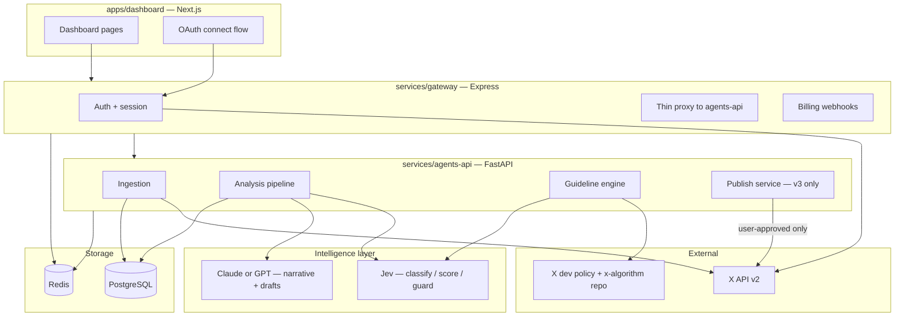

# C2C — Full Architecture & Dashboard Spec

> Consolidated reference: system architecture, purified repo structure, backend
> endpoints (Express gateway + FastAPI agents-api), and a page-by-page dashboard
> spec — what displays where, and in what format (table, chart, card, etc.).

---

## 1. System architecture



**Division of labor:** the gateway is user-facing and thin (auth, session, proxying,
billing webhooks). The agents-api is internal-only — never reachable from the
browser, only from the gateway over an internal network with a service token —
and does the actual work: ingestion, Jev classification, LLM narrative
generation, guideline enforcement.

---

## 2. Purified repo structure

```
agent-X/
├── apps/
│   └── dashboard/                 # Next.js — trimmed to real 
│       ├── app/
│       │   ├── (dashboard)/
│       │   │   ├── overview/
                ├── engage
│       │   │   ├── analyze
│       │   │   ├── compliance/
│       │   │   ├── compose/        
│       │   │   └── settings/
```

**Deleted** (template demo weight): `app/(dashboard-layout)/apps/{blog,notes,tickets}`,
`app/api/{blog,notes,ticket,code,userprofile}` (note: `/api/code` was an arbitrary
file-read vulnerability — delete, don't just deprecate), `app/context/*-context`,
`app/components/apps/*`, fake table datasets under `components/tables/*data.ts`.

**Kept as scaffolding**: `app/auth/*` (real OAuth logic goes in), `components/ui/*`
(theme-agnostic shadcn primitives), layout/sidebar shell.

---

## 3. Backend endpoints

### 3.1 Express gateway — user-facing

| Method | Endpoint | Purpose |
|---|---|---|
| POST | `/auth/x/connect` | Start X OAuth 2.0 (PKCE) |
| GET | `/auth/x/callback` | OAuth callback, token exchange |
| POST | `/auth/logout` | Clear session |
| GET | `/session/me` | Current user + plan tier |
| GET | `/accounts` | List connected accounts |
| DELETE | `/accounts/:id` | Disconnect an account |
| POST | `/posts/analyze` | v0 — single post URL → proxies to agents-api |
| GET | `/reports/:accountId/latest` | Latest postmortem report |
| GET | `/reports/:accountId/history` | Past report versions |
| POST | `/reports/:accountId/refresh` | Trigger on-demand re-analysis |
| GET | `/audience/:accountId` | Follower-type breakdown |
| GET | `/active-times/:accountId` | Posting-time vs audience-activity data |
| GET | `/compliance/:accountId` | Guideline scorecard + flags |
| GET | `/suggestions/:accountId` | Suggestion feed |
| POST | `/suggestions/:id/accept` \| `/dismiss` | User action on a suggestion |
| GET | `/drafts/:accountId/queue` | v3 — scheduled draft queue |
| POST | `/drafts/:id/approve` | v3 — user approves a draft to publish |
| POST | `/billing/webhook` | Stripe webhook receiver |
| GET | `/billing/plan` | Current plan/usage |

### 3.2 FastAPI agents-api — internal only

| Method | Endpoint | Purpose |
|---|---|---|
| POST | `/ingest/{platform}/{account_id}` | Trigger ingestion job |
| GET | `/ingest/{account_id}/status` | Job status |
| POST | `/analyze/post` | v0 — single post: X API + Jev + LLM |
| POST | `/analyze/profile/{account_id}` | v1 — full postmortem pipeline |
| POST | `/classify/followers` | Bulk Jev classification job |
| POST | `/guardrail/check` | Jev boolean check, run before anything reaches the dashboard |
| GET | `/guideline-rules/current` | Current structured ruleset |
| POST | `/guideline-rules/refresh` | Internal cron — re-crawl policy + `x-algorithm` |
| POST | `/suggestions/generate/{account_id}` | v2 — generate suggestion cards |
| POST | `/publish/{account_id}` | v3 — posts via X API, only after gateway confirms approval |

---

## 4. Dashboard — page-by-page spec

Each page lists its widgets in the order they appear, top to bottom, with the
exact display format for each.

### 4.1 Overview (home)

| Section | Format |
|---|---|
| Greeting header ("Good morning, {name}") + subtitle | Text |
| Period selector (7d / 30d / 90d) + Export button | Dropdown + button, top right |
| Update banner ("Engagement rate up 12% this week") | Single-line banner with link to detail |
| Health score over time | Line chart, main panel |
| Followers / Impressions / Engagement rate / Posts this period | 4 stat cards, grid, right of chart |
| Top post this period / New followers / Flagged issues | 3 metric rows, each with a "See details →" link |
| Recent posts | Sortable table — columns: Post, Type, Score, Engagement, Date, Status (badge: Good / Needs work / Flagged) |

### 4.2 Post analyzer (v0)

| Section | Format |
|---|---|
| URL input + Analyze button | Input field + button |
| Post preview | Embedded post card |
| Sub-score breakdown (Hook, Structure, Sentiment, Shareability) | Horizontal bar chart, one bar per sub-score |
| AI-slop score | Gauge/meter widget |
| "vs your account average" | Single stat card with delta arrow |
| Improvement suggestions | List of short text cards, one per suggestion |

### 4.3 Profile postmortem (v1)

| Section | Format |
|---|---|
| Follower growth / Engagement trend / Health score / Compliance score | 4 stat cards, top row |
| Engagement & impressions over time | Line chart, dual series |
| Top performing posts | Sortable table — Post, Type, Views, Engagement rate, Shareability |
| Underperforming posts | Same table format, rows highlighted amber/red |
| Export report | Button, top right (PDF / MD) |

### 4.4 Audience intelligence

| Section | Format |
|---|---|
| Follower-type breakdown (engineer, founder, politician, etc.) | Donut chart with legend |
| Audience growth vs churn | Bar chart, two series |
| Filter by follower type | Dropdown, filters the table below |
| Top engaging followers | Table — Handle, Type, Engagement count, Last active |

### 4.5 Active times

| Section | Format |
|---|---|
| Audience activity by day/hour | Heatmap grid (7 rows × 24 columns), color intensity = activity |
| Your actual posting times | Overlaid markers on the same heatmap |
| Best posting window | Single stat card, e.g. "Tue 9–11am" |

### 4.6 Guideline & compliance

| Section | Format |
|---|---|
| Overall compliance score | Gauge/dial widget |
| Violations over time | Line chart |
| Flagged items | Table — Post, Rule violated, Severity (badge), Date, Status |
| Row expansion | Click a row → inline expansion with plain-language explanation + cited source rule |

### 4.7 Suggestions feed (v2)

| Section | Format |
|---|---|
| Filter tabs (All / Content / Timing / Compliance) | Tab bar |
| Suggestion cards | Vertical list of cards — each: title, evidence snippet, Accept / Dismiss / "Ask for rewrite" |

### 4.8 Compose & schedule (v3)

| Section | Format |
|---|---|
| Draft editor | Textarea with live character count + inline X post preview |
| Guardrail results | Row of pass/fail badges, one per checked rule |
| Schedule picker | Date/time picker |
| Queue | Table — Draft (truncated), Scheduled time, Status |

### 4.9 Reports & exports

| Section | Format |
|---|---|
| Date-range filter | Dropdown |
| Report history | Table — Date, Type, Score, Download link |

### 4.10 Settings

| Section | Format |
|---|---|
| Connected accounts | One card per platform — icon, handle, status, Disconnect button |
| Plan & billing | Card with usage bar (e.g. "68/100 monthly analyses used") + Upgrade button |
| Notification preferences | Toggle list |

---

## 5. Open items

- Confirm X API access tier (Basic/Pro needed for meaningful historical read volume).
- Decide guideline-engine refresh cadence (weekly proposed, matches the recency-filter pattern from agent-X).
- Confirm monorepo tooling (npm workspaces vs. Turborepo) before scaffolding `services/`.
- `dashboard/app/api/code/route.ts` must be deleted before any deployment — arbitrary file-read vulnerability.


our pricing model 

Plan	Price	Analyses/month	Connected_accounts	Seats	What it unlocks

Free	  $0	 4 (~1/week)	         1	           1	Basic taste of the product — enough to try Post Analyzer and see a health score, not enough to
rely on


Creator	$19/mo ($190/yr)	60	         1	           1	Full Analyze page (post analyzer, postmortem, audience, active times) at a real cadence

Pro	$59/mo ($500/yr)	Unlimited	     3	           1	Everything in Creator, plus Engage (the watch-the-feed opportunity finder) and Compose (v3 approval-gated publishing)


Agency	$199/mo ($1,900/yr)	Unlimited	  25	       5	Everything in Pro, multiplied for managing multiple clients' accounts with a team
