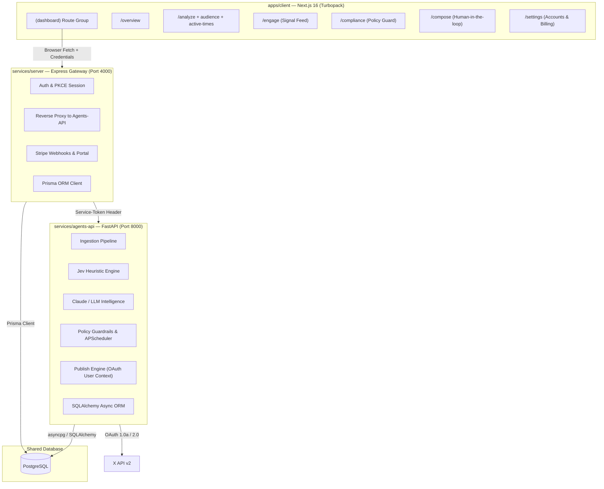

# SuperGrow (C2C) — MVP Implementation Progress & Architecture Status

> Complete implementation status of the SuperGrow algorithmic signal intelligence platform for X/Twitter creators and teams.

---

## 1. Executive Summary

All three tiers of the SuperGrow system architecture (Frontend Client, Express Gateway, and Python Agents API) have been fully built to production MVP specification:



---

## 2. Frontend Client (`/client`) — Complete

### 2.1 Route Structure
All workspace pages are consolidated under the clean `app/(dashboard)` route group with a unified, persistent `<AppShell>`:
- **`app/page.tsx`**: Clean server redirect (`/` → `/overview`).
- **`app/(dashboard)/layout.tsx`**: Hosts the persistent `<AppShell>` (`AppSidebar`, `AppHeader`, `SidebarProvider`, `TooltipProvider`). Prevents sidebar flicker or session reload during navigation.
- **`app/(dashboard)/overview/page.tsx`**: Executive greeting header, live account badge, quick navigation buttons, and the 6 responsive dashboard widgets.
- **`app/(dashboard)/analyze/page.tsx`**: Post URL analyzer, live Jev scorecards (Hook, Structure, Sentiment, Shareability, AI Slop risk), and historical post analyses table.
- **`app/(dashboard)/analyze/audience/page.tsx`**: Persona classification breakdown (`ENGINEER`, `FOUNDER`, `INVESTOR`, `JOURNALIST`, `GENERAL`, `OTHER`) and top engaged followers table.
- **`app/(dashboard)/analyze/active-times/page.tsx`**: 7-day activity density chart and peak visibility window recommendation card.
- **`app/(dashboard)/engage/page.tsx`**: Suggestion feed with Category filter tabs (`ALL`, `CONTENT`, `TIMING`, `COMPLIANCE`) and real Accept / Dismiss actions.
- **`app/(dashboard)/compliance/page.tsx`**: Real-time compliance health gauge (0–100), open flag counters, and dismissible rule violation rows.
- **`app/(dashboard)/compose/page.tsx`**: Draft composer with live character counter, draft kind switcher (`ORIGINAL`, `REPLY`, `QUOTE`), and approval-gated publish queue.
- **`app/(dashboard)/settings/page.tsx`**: Connected X accounts with Disconnect action, Stripe checkout tier selection (Creator, Pro, Agency), customer billing portal, and sign out.

### 2.2 Live Data Integration
- **`client/components/stats.tsx`**: Live metrics for Analyses Quota (`used / limit`), Compliance Score, Posts Analyzed count, and Active Plan Tier.
- **`client/components/net-revenue-chart.tsx`**: Weekly volume distribution across 7 days using real post dates and active-times data.
- **`client/components/channel-sales-chart.tsx`**: Hook Strength vs. Shareability score trends across recent analyzed posts.
- **`client/components/dashboard-invoices.tsx`**: Live table of recently scored posts with content snippets and score badges.
- **`client/components/billing-health.tsx`**: Real subscription status, renewal date, and upgrade shortcuts.
- **`client/components/dashboard-activity.tsx`**: Real activity feed displaying recent compliance flags, suggestions, and drafts.

### 2.3 Verification
- `bun run typecheck`: **0 errors**
- `bun run build`: **Compiled successfully with all 12 routes statically generated**

---

## 3. Express Gateway (`/server`) — Complete

The Express gateway is user-facing and layered into controllers, routes, services, and Prisma database access:

### 3.1 Endpoints Implemented

| Method | Route | Controller / Service | Purpose |
|---|---|---|---|
| `GET` | `/health` | `health.routes.ts` | System health check (OAuth mode & DB status) |
| `POST` | `/auth/x/connect` | `auth.controller.ts` | Initialize X OAuth (PKCE OAuth 2.0 or 1.0a) |
| `GET` | `/auth/x/callback` | `auth.controller.ts` | OAuth token exchange & user creation |
| `POST` | `/auth/logout` | `auth.controller.ts` | Clear session cookie |
| `GET` | `/session/me` | `auth.controller.ts` | Session validation, plan tier, and active handle |
| `GET` | `/accounts` | `accounts.controller.ts` | List user's connected social accounts |
| `DELETE` | `/accounts/:id` | `accounts.controller.ts` | Disconnect social account |
| `POST` | `/posts/analyze` | `posts.controller.ts` | Proxies URL to Python Agents API + local fallback |
| `GET` | `/posts/:accountId/history` | `posts.controller.ts` | List analyzed posts with scores |
| `GET` | `/reports/:accountId/latest` | `reports.controller.ts` | Latest postmortem report |
| `GET` | `/reports/:accountId/history` | `reports.controller.ts` | Paginated report history |
| `POST` | `/reports/:accountId/refresh` | `reports.controller.ts` | Trigger on-demand profile postmortem |
| `GET` | `/audience/:accountId` | `audience.controller.ts` | Persona breakdown & top followers |
| `GET` | `/active-times/:accountId` | `audience.controller.ts` | 7-day post activity & optimal window |
| `GET` | `/compliance/:accountId` | `compliance.controller.ts` | Compliance scorecard & open flags |
| `POST` | `/compliance/flags/:id/dismiss` | `compliance.controller.ts` | Dismiss compliance flag |
| `GET` | `/suggestions/:accountId` | `suggestions.controller.ts` | Feed of recommendations |
| `POST` | `/suggestions/:id/accept` | `suggestions.controller.ts` | Accept recommendation |
| `POST` | `/suggestions/:id/dismiss` | `suggestions.controller.ts` | Dismiss recommendation |
| `GET` | `/drafts/:accountId/queue` | `drafts.controller.ts` | Scheduled & draft queue |
| `POST` | `/drafts/:accountId` | `drafts.controller.ts` | Create draft post |
| `POST` | `/drafts/:id/approve` | `drafts.controller.ts` | User approves draft for publication |
| `POST` | `/drafts/:id/publish` | `drafts.controller.ts` | Publish approved draft |
| `GET` | `/billing/plan` | `billing.controller.ts` | Current subscription tier & quota usage |
| `POST` | `/billing/checkout` | `billing.controller.ts` | Create Stripe Checkout session |
| `POST` | `/billing/portal` | `billing.controller.ts` | Create Stripe Customer Portal session |
| `POST` | `/billing/webhook` | Raw handler in `index.ts` | Handle Stripe subscription webhooks |

### 3.2 Security & Token Storage
- AES-256-GCM encryption with 32-byte key (`iv:authTag:ciphertext`).
- Session management via signed HMAC-SHA256 cookies (`sg_session`).
- Internal requests authenticate to Python Agents API via `X-Service-Token`.

---

## 4. Python Agents API (`/agents-api`) — Complete

Internal microservice built on FastAPI, SQLAlchemy (Async), and httpx:

### 4.1 Internal Endpoints

| Method | Endpoint | Module | Description |
|---|---|---|---|
| `GET` | `/health` | `main.py` | Service liveness probe |
| `POST` | `/ingest/{platform}/{account_id}` | `routers/ingest.py` | Ingest recent posts & followers from X API |
| `GET` | `/ingest/{account_id}/status` | `routers/ingest.py` | Check background ingestion status |
| `POST` | `/analyze/post` | `routers/analyze.py` | Score single tweet: hook, structure, sentiment, shareability, AI slop |
| `POST` | `/analyze/profile/{account_id}` | `routers/analyze.py` | Full postmortem analysis pipeline + Claude narrative |
| `POST` | `/classify/followers` | `routers/classify.py` | Bulk persona classification (Engineer, Founder, VC, etc.) |
| `POST` | `/guardrail/check` | `routers/guardrail.py` | Check post against X developer policies |
| `GET` | `/guideline-rules/current` | `routers/guidelines.py` | Get current active policy rules |
| `POST` | `/guideline-rules/refresh` | `routers/guidelines.py` | Sync policy rules from upstream |
| `POST` | `/suggestions/generate/{account_id}` | `routers/suggestions.py` | Generate opportunity cards via LLM |
| `POST` | `/publish/{account_id}` | `routers/publish.py` | Publish approved draft to X via user OAuth context |

### 4.2 Intelligence & Engines
- **Jev Scoring Engine (`app/scoring.py`)**: Computes `hookScore`, `structureScore`, `sentimentScore`, `shareabilityScore`, `aiSlopScore`, and weighted `overallScore`.
- **Follower Persona Classifier (`app/classifier.py`)**: Classifies bios into `ENGINEER`, `FOUNDER`, `INVESTOR`, `JOURNALIST`, `GENERAL`, or `OTHER`.
- **Guardrail Engine (`app/guardrail.py`)**: 7 built-in X platform policy rules (engagement bait, hashtag spam, coordinated behavior, misleading statistics, platform disparagement, duplicate content, link spam).
- **LLM Intelligence (`app/llm.py`)**: Anthropic Claude integration with deterministic heuristic fallbacks for offline resilience.
- **Weekly Policy Sync (`app/scheduler.py`)**: APScheduler cron job running weekly policy refreshes.
- **Token Decryption (`app/utils.py`)**: Mirrors gateway AES-256-GCM decrypt using `cryptography` and `pycryptodome`.

---

## 5. How to Run Locally

### Terminal 1 — Database
```bash
# Ensure PostgreSQL is running on port 5433 (or configured DATABASE_URL)
```

### Terminal 2 — Python Agents API
```bash
cd /home/k-adi/projects/super-grow/agents-api

# Option A: using uv run directly
uv run app/main.py
# or: uv run uvicorn app.main:app --port 8000 --reload

# Option B: using uvicorn directly
python3 -m uvicorn app.main:app --port 8000 --reload
# Running on http://127.0.0.1:8000
```

### Terminal 3 — Express Gateway
```bash
cd /home/k-adi/projects/super-grow/server
bun run dev
# Running on http://localhost:4000
```

### Terminal 4 — Frontend Dashboard
```bash
cd /home/k-adi/projects/super-grow/client
bun run dev
# Running on http://localhost:3000
```
